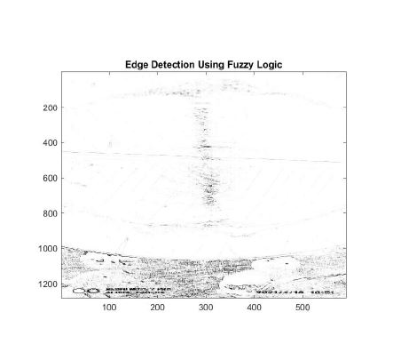

# Construction-of-a-Fuzzy-Inference-system-for-a-Closed-loop-control-system-appliance-Dishwasher-
It is a Control System project using MATLAB that helps to overcome the limitations of a dishwasher .

### Application of  Fuzzy Logic Image processing.
The washed dishes in the dishwasher tend to have edgy-like appearance on them after the washing process thus , with the help of Fuzzy logic Image processing , we can detect the edges on the surface .

Edges :
Edge is basically a boundary between two uniform regions , Detection of edges basically takes place by comparing the intensities of neighbouring pixels .One can also say that edges are like significant changes of intensity in a digital image.

Edge Detection:
It is a method of segmenting an image into regions of discontinuity. 
Edge detection is a widely used technique for various pattern recognition , image morphology and feature extraction .
Thus with the help of edge detection the user can observe the significant change in the gray level of the image .
Thus in order to observe the amount of edges present in the washed dishes , we can implement the fuzzy logic method in MATLAB.

### STEPS: 
      
1. First take the image of the dish and import it , and convert it in grayscale in MATLAB , so that it gets converted into 2D array instead of 3D array.
2.With the help of evalfis function , the fuzzy interferences are being evaluated and im2double function is used to convert to a double array .
3.Now obtain the image gradient , to locate the breaks in the uniform regions of the dishes  , form a matrix of x axis  and convole with I using the conv2 function.(The range of the gradients are from [-1 1]) , similarly to do it for y - axis as well.
4.Thus now we can see the gradient in the dishes .
5.In order to create the fuzzy inference system (FIS) for edge detection , I used the variable as edgeFIS.
6.Give the input of the Ix and Iy in edge FIS and specify the image gradient , specify zero- mean Gaussian membership function for each input (which will belong to zero membership function) .
7.To adjust the performance of the  edge detector , one can keep changing the value of sx and sy (increasing the values makes the algorithm less sensitive to the edges ).
8.Similarly we can also adjust the values of wa ,wb ,wc,ba,bb and bc as these triplets specify the start peak and end of the triangles .
9.Then one can plot the membership function of the input and outputs of the edgeFIS.
10.In order to clearly  distinguish between the uniform and the other regions we can also set up some rules using the “addRule” function(if the direction has a non- zero gradient , then the pixel will be on the edge.)
11.Thus evaluate the output of the edge for each row of pixels in I using corresponding rows of Ix and Iy as inputs.
12.Plot the original grayscale image .
13.Plot the detected images .

## Result :

# Final output 

